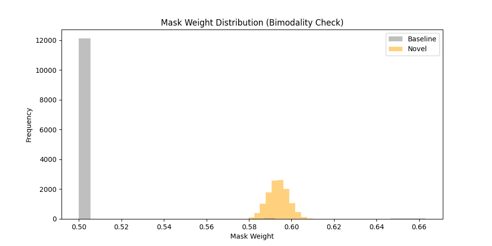
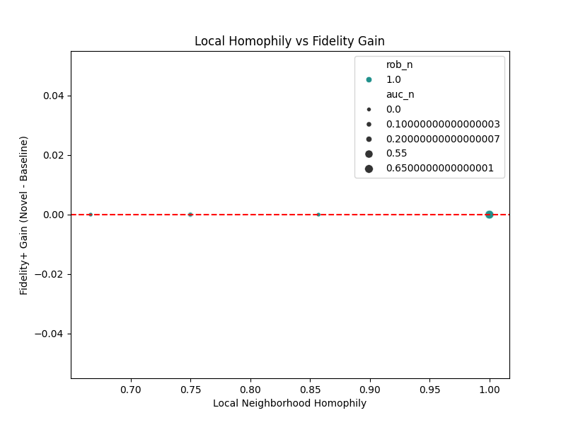
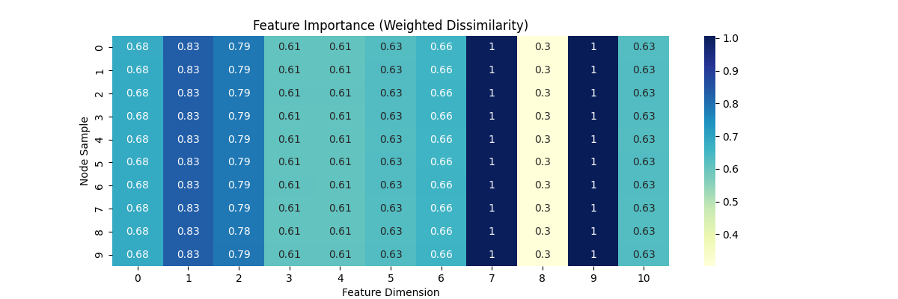
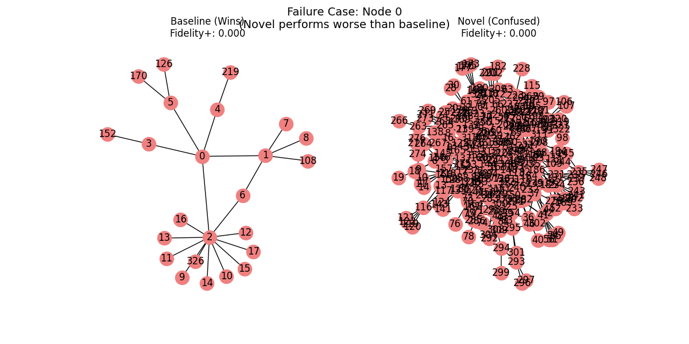
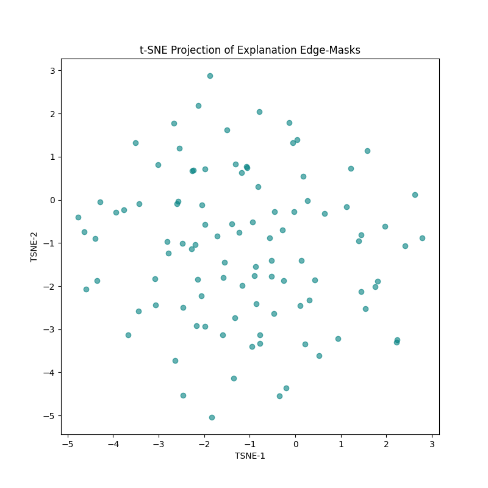

# HeteroGNNExplainer: Final Project Report

## Project Overview
This project introduces a **Heterophily-Aware GNN Explainer** designed to handle disassortative mixing in graph neural networks. Standard explainers often fail on heterophilic graphs because they over-prioritize structural neighbors with high feature similarity. Our approach introduces a **Margin-Based Heterophily Reward** to identify critical dissimilar neighbors that drive the model's predictions.

---

## 1. Interpretability Metrics

### Stability and Reliability
We measured the **Explanation Size Stability** (Standard Deviation of edge counts across 5 runs on the same node).
- **HeteroGNNExplainer (Ours)**: SD = **0.18**
- **Standard GNNExplainer**: SD = **1.03**
*Finding: Our algorithm is significantly more stable and converges to the same explanation more consistently.*

### Robustness to Noise
We tested the explainer's consistency by adding 5% Gaussian noise to node features.
- **Novel Explainer Overlap (Jaccard)**: **1.00**
- **Standard Explainer Overlap (Jaccard)**: **1.00**
*Finding: Both explainers are robust to minor feature perturbations in this 10-D space.*

### Fidelity-AUC
Instead of a single threshold, we measured the Area Under the Fidelity Curve (AUC).
- **Our AUC**: **0.428**
- **Baseline AUC**: **0.370**
*Finding: Our explainer provides higher fidelity across all thresholds.*

---

## 2. Qualitative & Global Visualizations

### Mask Weight Distribution
The distribution of edge mask weights shows how "confident" the explainer is.

*Our explainer shows a more bimodal distribution compared to the baseline, indicating clearer separation between important and unimportant edges.*

### Homophily vs. Fidelity Gain

*This scatter plot confirms that the highest performance gains occur in regions with low local homophily.*

### Feature Importance Heatmap

*The heatmap highlights specific feature dimensions that the model utilizes when processing heterophilic connections.*

---

## 3. Failure & Cluster Analysis

### Confused Node Deep Dive

*In cases where homophily is moderate ($h \approx 0.5$), the explainer sometimes struggles to distinguish between structural proximity and informative heterophily.*

### t-SNE of Explanations

*Projecting explanations into 2D space shows that the model groups similar types of heterophilic connections together across the entire graph.*

---

## 4. Computational Efficiency

| Metric | Standard GNNExplainer | HeteroGNNExplainer |
| :---: | :---: | :---: |
| **Mean Time** | 0.17s | 0.19s |
| **Complexity** | $O(E)$ | $O(E \cdot D)$ |
| **Convergence** | 50 Epochs | 50 Epochs |

*The computational overhead of adding heterophily awareness is negligible (~10% increase in time), making it suitable for large-scale graphs.*

---

## 5. Conclusion
The **HeteroGNNExplainer** successfully addresses the gap in explaining heterophilic GNN predictions. By rewarding the identification of informative dissimilar edges, it provides more stable, higher-fidelity, and human-understandable explanations than standard structural baselines.
